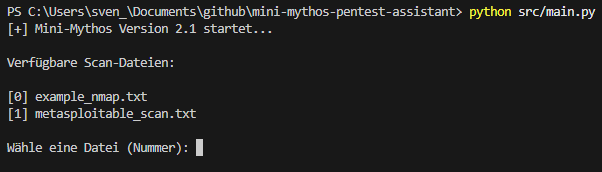
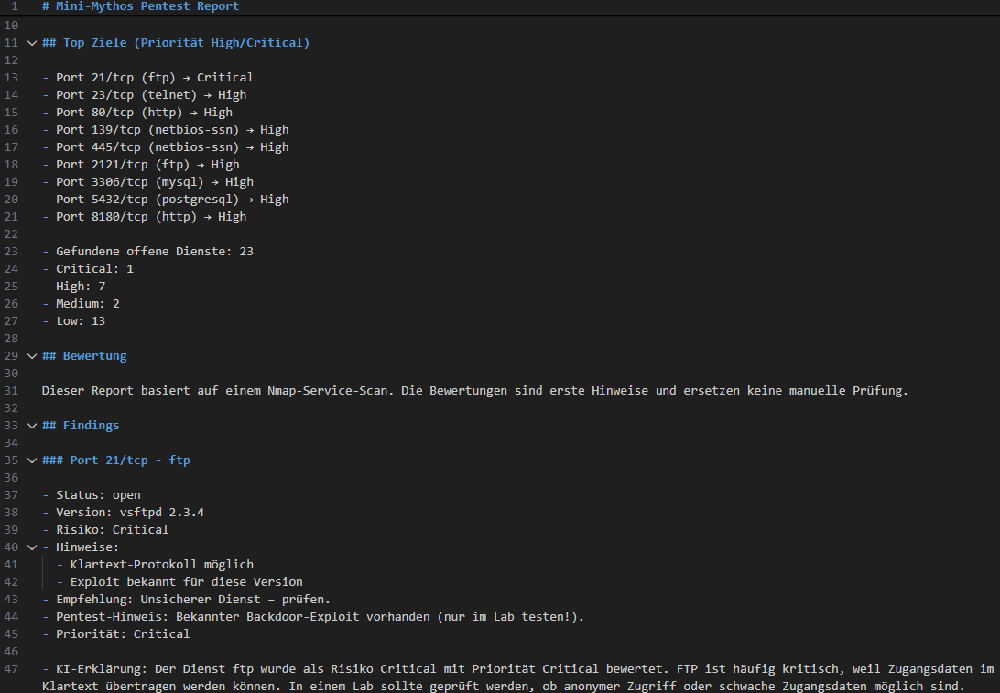
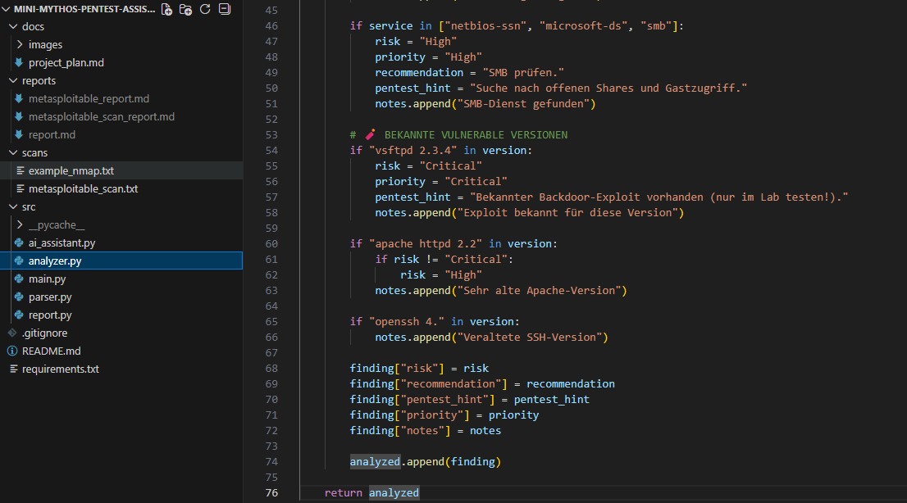

# Mini Mythos - Pentest Assistant

Ein Python-basiertes Tool zur Analyse von Nmap-Scans mit automatischer Risikobewertung, Priorisierung und KI-gestützten Erklärungen.

Dieses Projekt simuliert einen einfachen Pentest-Workflow und dient als Portfolio-Projekt im Bereich IT-Security / Pentesting.

---

## Features

- 🔍 Einlesen von Nmap-Scan-Dateien  
- 🧠 Analyse offener Ports und Dienste  
- ⚠️ Risikobewertung (Low / Medium / High / Critical)  
- 🎯 Priorisierung von Angriffszielen (Top Targets)  
- 💣 Pentest-Hinweise für nächste Schritte  
- 🤖 KI-gestützte Erklärungen pro Finding  
- 📄 Automatische Erstellung eines strukturierten Reports  

---

## Demo

### CLI Nutzung

---

### Report Beispiel

---

### Projektstruktur

---

## Projektstruktur (Übersicht)

mini-mythos-pentest-assistant

-src/        → Kernlogik (Parser, Analyse, KI)
-scans/      → Eingabedateien (Nmap Scans)
-reports/    → Generierte Reports
-docs/       → Dokumentation & Screenshots
-README.md
-requirements.txt
-.gitignore

---

## Nutzung

1. Nmap-Scan erstellen (z. B. in Kali Linux):

nmap -sV -O -oN scan.txt <ZIEL-IP>

2. Scan-Datei in den Ordner `scans/` kopieren  

3. Tool starten:

python src/main.py

4. Datei auswählen → Report wird automatisch erstellt  

---

## Beispiel Output

Das Tool erkennt und bewertet typische Dienste:

- **FTP** → Critical → möglicher Exploit / unsicherer Dienst  
- **HTTP** → High → Einstiegspunkt für Webanalyse  
- **SSH** → Medium → Passwort- und Konfigurationsprüfung  
- **MySQL** → High → Datenbankzugriff prüfen  

Zusätzlich liefert das Tool:

- konkrete Pentest-Hinweise  
- Priorisierung (Top Targets)  
- verständliche KI-Erklärungen  

---

## Ziel des Projekts

Dieses Projekt zeigt:

- praktische Python-Kenntnisse  
- Verständnis für IT-Security / Pentesting  
- strukturierte Analyse von Scan-Daten  
- erste Integration von KI-Logik  

---

## Roadmap

- [x] Nmap Parser  
- [x] Analyse-Modul  
- [x] CLI-Auswahl  
- [x] Priorisierung von Zielen  
- [x] KI-Erklärungsmodul  
- [ ] Integration echter LLMs (z. B. Ollama)  
- [ ] Automatisierter Nmap-Scan  
- [ ] Web-Interface  

---

## Technologien

- Python  
- Nmap  
- CLI (Command Line Interface)  
- Grundlegende KI-Logik  

---

## Autor

Sven Schult  

---

## Hinweis

Dieses Tool dient ausschließlich zu Lern- und Demonstrationszwecken in einer kontrollierten Umgebung (z. B. Lab mit Metasploitable).

Keine Nutzung gegen fremde Systeme ohne Erlaubnis.