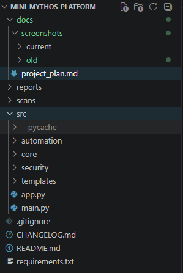
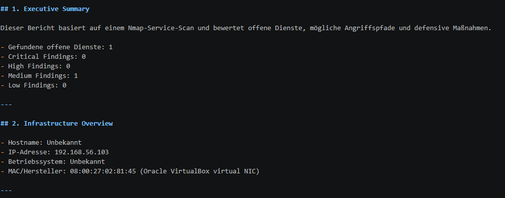
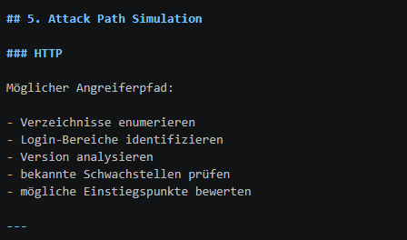
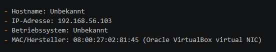

# Mini Mythos Platform

Eine modulare Plattform für Infrastructure-, Netzwerk- und Security-Analyse mit Python, Automatisierung und KI-Unterstützung.

Mini Mythos dient als praxisnahes Homelab- und Portfolio-Projekt mit Fokus auf:

- Infrastruktur verstehen
- Netzwerke analysieren
- Security bewerten
- Angriffswege nachvollziehen
- defensive Maßnahmen ableiten
- Automatisierung und Reporting

---

## Projektziel

Mini Mythos soll langfristig zu einer modularen Security- und Infrastructure-Analysis-Plattform ausgebaut werden.

Das Projekt kombiniert:

- Python-Automatisierung
- Netzwerk-Analyse
- Security Assessment
- KI-Unterstützung
- Reporting & Dokumentation
- Homelab-Integration

---

## Screenshots

### Plattform-Architektur

---

### Security Assessment Report

---

### Angriffspfad-Simulation

---

### Automatische Zielerkennung

## Kernfunktionen

### Infrastructure Discovery
- Analyse von Nmap-Scans
- automatische Zielerkennung
- Erkennung von:
  - Hostname
  - IP-Adresse
  - Betriebssystem
  - MAC-Adresse / Hersteller

### Security Analysis
- Risikobewertung
- Priorisierung kritischer Dienste
- Security Findings
- Angriffspfad-Simulation

### Defensive Recommendations
- Hardening-Empfehlungen
- defensive Maßnahmen
- Security-Kontext

### Automation
- automatische KI-Initialisierung
- Ollama-Integration
- automatisierte Report-Erstellung

### Reporting
- Executive Summary
- Infrastructure Overview
- Security Findings
- Attack Path Simulation
- Defensive Recommendations
- Next Steps

---

## Architektur

mini-mythos-platform
│
├── src/
│   ├── main.py
│   │
│   ├── core/
│   │   ├── parser.py
│   │   ├── report.py
│   │   └── ai_assistant.py
│   │
│   ├── security/
│   │   ├── analyzer.py
│   │   ├── attack_paths.py
│   │   └── defensive_recommendations.py
│   │
│   └── automation/
│       └── setup_ai.py
│
├── scans/
├── reports/
├── docs/
│
├── README.md
├── CHANGELOG.md
├── requirements.txt
└── .gitignore

---

## Voraussetzungen

- Python 3.x
- Nmap
- Ollama

Ollama Download:

https://ollama.com

---

## Installation

Repository klonen:

git clone https://github.com/svenschult/mini-mythos-platform

Projektordner öffnen:

cd mini-mythos-platform

Abhängigkeiten installieren:

pip install -r requirements.txt

---

## Nutzung

### 1. Nmap-Scan erstellen

Beispiel:

nmap -sV -O -oN scan.txt <ZIEL-IP>

Die Datei anschließend speichern unter:

scans/scan.txt

---

### 2. Plattform starten

python src/main.py

---

## Automatische KI-Initialisierung

Beim Start passiert automatisch:

- Ollama wird gestartet
- KI-Modell wird geprüft
- Modell wird geladen (falls nötig)

Keine manuelle Einrichtung erforderlich.

---

## Security-Ansatz

Mini Mythos fokussiert sich nicht nur auf Angriffe, sondern auf das Verständnis kompletter Security-Szenarien.

Die Plattform analysiert:
- mögliche Angriffspfade
- Risiken
- Fehlkonfigurationen
- defensive Maßnahmen
- Infrastruktur-Kontext

---

## Geplante Erweiterungen

### Infrastructure
- Netzwerk-Topologie
- Host-Inventory
- Netzwerksegmentierung
- Asset Discovery

### Security
- erweiterte Angriffspfade
- Schwachstellenanalyse
- Hardening-Checks
- laterale Bewegungsanalyse

### Automation
- automatischer Nmap-Scan
- Vergleich mehrerer Scans
- geplante Scans

### Reporting
- PDF-Export
- Dashboard
- modernes Web UI

---

## Technologien

- Python
- Nmap
- Ollama
- Requests
- Git / GitHub

---

## Projektstatus

Aktive Entwicklung

Aktueller Fokus:
- modulare Architektur
- Security-Analyse
- Infrastruktur-Verständnis
- Homelab-Integration
- Automatisierung

---

## Autor

Sven

---

## Hinweis

Dieses Projekt dient ausschließlich zu Lern-, Analyse- und Demonstrationszwecken in kontrollierten Umgebungen.

Keine Nutzung gegen fremde Systeme ohne ausdrückliche Erlaubnis.